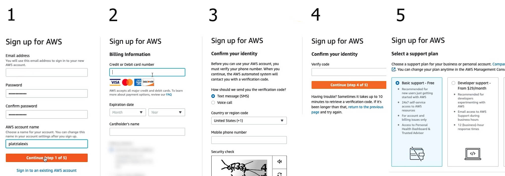

# Curso_de_Introduccion_a_AWS_Fundamentos_de_Cloud_Computing

**Curso de Introduccion a AWS Fundamentos de Cloud Computing**

<h2>Content List</h2>

- [Cómo Aprender AWS](#cómo-aprender-aws)
- [Visión General de las TI Tradicionales](#visión-general-de-las-ti-tradicionales)
- [Los Diferentes Tipos de Cómputo: IaaS vs PaaS vs SaaS](#los-diferentes-tipos-de-cómputo-iaas-vs-paas-vs-saas)
- [Una Visión Global: Regiones y Zonas de Disponibilidad](#una-visión-global-regiones-y-zonas-de-disponibilidad)

## Cómo Aprender AWS

Amazon web services (AWS) es el proveedor de servicios en la nube más grande del mundo. Muchas aplicaciones como Netflix, Meta y Platzi operan su arquitectura web gracias a su plataforma. 

**¿Qué aprender?**

* Historia de AWS
* Regiones y zonas de disponibilidad en AWS 
* Cómo crear tu cuenta de AWS
* Roles, seguridad e identidad en AWS

## Visión General de las TI Tradicionales

Entendamos primero como funciona la web en términos simples. Tenemos un **cliente** con una dirección Ip que se conecta a una **red** para hacer una **petición** a un **servidor** con otra dirección IP. Este servidor devuelve una respuesta al cliente. 

Si la web fuera un servicio postal, el **cliente** seríamos nosotros con la **petición** o paquete que queremos enviar, la **red** sería el sevicio postal en sí y el **servidor** representaría al destinatario al que queremos enviar el paquete. 

<h3>Cómo está Compuesto un Servidor?</h3>

Un servidor posee los siguientes componenetes: 

* **Cómputo/CPU**: Realiza las operaciones que necesitamos
* **Memoria RAM** Contiene la información a procesar mediante la CPU. Es como un cerebro
* **Almacenamiento**: Archiva datos, a modo de archivos de texto plano. 
* **Bases de Datos**: Información almacenada de manera estructurada
* **Redes**: Cables, routers y servidoress conectados unos a otros. Servidores DNS

<h3>Terminología de IT (redes)</h3>

En términos generales, un cliente envía un paquete a un **router**, el cual reenvía este paquete al **swith**, y este se encarga de distribuirlo. 

* **Router**: Dispositivo que reenvía paquetes de datos entre redes informáticas 
* **Switch**: Dispositivo que toma paquetes y los envía al servidor/cliente correcto en la red. 

<h3>Diseño Tradicional de Infraestructura</h3>

Las grandes empresas de IT empezaron comprando servidores y montándolos en sus garajes. Se encontraron con problemas al tratar de expandir su infraestructura, como los costos de mover estos servidores, comprar nuevos, y más...

<h4>Problemas del enfoque de IT Tradicional</h4>

Algunas dificultades del enfoque de tecnología de la información habitual: 

* **Renta**: Los costos de rentar espacios para mantener servidores son altos
* **Mantenimiento**: El funcionamiento de los servidores es díficil de asegurar
* **Reemplazar y Agreagar Hardware**: Pueden existir largos tiempos de espera para conseguir el hardware necesario
* **Escalamiento Limitado**: Podemos vernos limitados por el espacio donde almacenamos los servidores
* **Monitoreo 24/7**: Debemos contratar gente para monitorear los servidores
* **Desastres Naturales**: ¿Cómo evitamos que se caigan nuestros servicios si ocurre un imprevisto? 

## Qué es la Computación en la Nube

La computación en la nube es la entrega bajo demanda de recursos de IT como computación, almacenamiento y otros servicios a través de internet. En pocas palabras, es como si alquiláramos la computadora de otra persona.

Esta tecnología permite acceso instantáneo a los recursos que necesites, así como la adquisición del tipo y tamaño exacto de estos recursos. Algunos servicios que seguramente has usado son Gmail (proveedor de email), Dropbox (proveedor de almacenamiento) y Netflix (proveedor de video bajo demanda).

<h3>Modelos de computación en la nube</h3>

A continuación, conocerás las distintas plataformas en la nube que utilizamos cuando trabajamos en proyectos personales o en nuestra empresa.

<h4>Nube pública</h4>

La nube pública se refiere a los recursos de proveedores que utilizamos a través de internet y algunos ejemplos son Google Cloud Platform (GCP), Azure y AWS.

Además, posee estas ventajas:

* Elimina los gastos de capital comercial (CapEx) y reduce el gasto operativo (OpEx).
* Reduce los precios en economías de escala
* Despliega aplicaciones a nivel global en cuestión de minutos

<h4>Nube privada</h4>

La nube privada es un servicio empleado por una organización que no está abierto al público. Permite un control total de la infraestructura y es útil para aplicaciones con requerimientos específicos de seguridad o comerciales.

<h4>Nube híbrida</h4>

La nube híbrida consiste en mantener nuestra infraestructura y extender sus capacidades mediante la nube pública. Posibilita el control sobre activos sensibles en tu infraestructura privada, aprovechando la flexibilidad y rentabilidad de la nube pública.

<h3>Características de la computación en la nube</h3>

Ahora que conoces los distintos modelos de tecnología en la nube, es importante que hablar sobre sus propiedades de computación.
* Autoservicio en demanda
* Amplio acceso a la red
* Multiples inquilino 
* Este modelo genera un autoservicio en demanda (con registros en la plataforma ya se pueden proveer recursos)
* Tiene un amplio acceso a la red
* Proporciona un espacio donde los clientes pueden compartir infraestructura y recursos de manera segura

<h3>Problemas resueltos por la nube</h3>

Por último, es crucial que conozcas las cualidades que trae implementar un sistema de computación en la nube.

* La nube aporta flexibilidad (puedes cambiar los tipos de recursos cuando sea necesario)
* Brinda rentabilidad y un servicio medido pues pagas solo por lo que usas
* Trae escalabilidad al agregar capacidad para hardware o equipos que necesitan acomodar cargas grandes
* Ofrece elasticidad al dar capacidad de escalar automáticamente cuando sea necesario
* Tiene alta disponibilidad y tolerancia a fallos
* Proporciona agilidad (puedes desarrollar, probar y ejecutar rápidamente aplicaciones en la nube)

## Los Diferentes Tipos de Cómputo: IaaS vs PaaS vs SaaS

* **IaaS:** Infraestructura como Servicio. Proporciona componentes básico para las tecnologías de información en la nube.
* **PaaS:** Plataforma como Servicio. Eliminar la necesidad de que nuestra rganización administre la infraestructura
* **SaaS:** Software como Servicio. Producto terminado que es administrado y ejecutado por el proveedor de servicio 

<h3>Ejemplos de los Tipos de Computación de la Nube</h3>

IaaS: Azure, Linode, Digital Ocean. 
PaaS: Google AppEngine. 
SaaS: Dropbox, Zoom, Gmail

## Una Pequeña Historia de AWS 

**Benjamin Black y Chris Pinkham** son los principales desarrolladores de Amazon Web Services y crearon esta compañía a partir de la necesidad de impulsar nuevas tecnológicas en momentos de mayor tráfico y demanda.

La historia de AWS está repleta de hitos, pues es una de las plataformas más utilizadas en distintas startups y compañías que están transformando su industria. ¡No te preocupes! Aquí te resumimos fácil su línea del tiempo.

<h3>Línea del tiempo de AWS</h3>

Hace veinte años nació esta promesa tecnológica y en la actualidad ¡tiene clientes en más de 245 países y territorios!

* 2002 → Se lanza internamente la plataforma
* 2003 → Comienza a comercializarse la idea de AWS
* 2004 → Llega al público el servicio SQS
* 2006 → Vuelve a lanzarse al público SQS, S3 y EC2
* 2007 → Abren operaciones en Europa
* 2009 → Lanzan el servicio RDS (Relational Database)
* 2010 → Sale al mercado el servicio Route 53
* 2012 → Lanzan DynamoDB (una base de datos no relacional)

<h3>AWS en números</h3>

Quizás sean un gran seguidor y fiel cliente de esta compañía, pero… ¿Conocías estos datos?

En 2019, AWS logró $35.02 mil millones de dólares en ingresos anuales
AWS representó el 47% del mercado en 2019
Esta plataforma posee más de un millón de usuarios activos

## Una Visión Global: Regiones y Zonas de Disponibilidad

La infraestructura de AWS está compuesta por **regiones, zonas de disponibilidad, data centers** y puntos de presencia. Además, se distribuye en diferentes regiones alrededor del mundo. Algunas de ellas son Ohio, Oregon, Norte de California, e incluso lugares exclusivos del gobierno de EE. UU. como GovCloud Este.

<h3>Cómo escoger una región de AWS</h3>

Podemos escoger la región de nuestra aplicación basada en distintos aspectos que mencionaremos a continuación.

<h4>Por ejemplo:</h4>

* El cumplimiento de los requisitos legales y de gobernanza de datos, pues los datos nunca abandonan una región sin su permiso explícito
* La proximidad con los clientes porque lanzan en una región cercana en donde estén para reducir latencia. Puedes revisar esta característica desde tu ubicación a cada región en [cloudping.info.](https://cloudping.info/)

* Los servicios disponibles dentro de una región debido a que muchos no funcionan en todas partes. Algunos servicios globales o regionales son…

    * **Globales**
        * IAM
        * Route 53
        * Cloudfront
        * WAF
    * **Regionales**
        * EC2
        * Beanstalk
        * Lambda
        * Rekognition

Los precios varían de región a región y son transparentes en la página de precios del servicio

<h3>Zonas de disponibilidad</h3>

Una zona de disponibilidad es un grupo de data centers donde cada uno está lleno de servidores. Estos data centers poseen energía, redes y conectividad redundante, están separados entre sí, conectados con un gran ancho de banda y redes de latencia ultra baja.

<h3>Modelo de responsabilidad compartida</h3>

Ahora es crucial determinar las responsabilidades de AWS y del cliente dentro del servicio tecnológico que ofrece la compañía.

<h4>AWS se hace responsable de:</h4>

* Hardware y la infraestructura global
* Regiones
* Zonas de disponibilidad
* Ubicaciones de AWS Edge / puntos de presencia
* Software
* Cómputo
* Almacenamiento
* Bases de datos
* Redes

<h4>El cliente se responsabiliza de:</h4>

* Actualizaciones de S.O. 
* Protección de los datos que se almacenan
* Manejo de aplicaciones
* Accesos
* Administración de usuarios y grupos

## Laboratorio: Crea tu Cuenta en AWS

Para crear tu cuenta de Amazon dirígete al [portal de AWS](https://portal.aws.amazon.com/billing/signup?nc2=h_ct&src=header_signup&redirect_url=https%3A%2F%2Faws.amazon.com%2Fregistration-confirmation&language=es_es#/start/email) y sigue estas instrucciones para crear tu cuenta.

1. Entra al portal de Amazon y registra tus datos

2. Introduce el número de tu tarjeta de crédito

3. Completa el CAPTCHA para verificar tu identidad

4. Verifica tu cuenta con un código de confirmación

5. Selecciona el plan que más se adapte a tus necesidades

